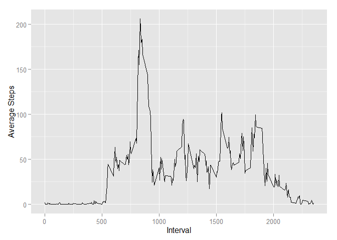
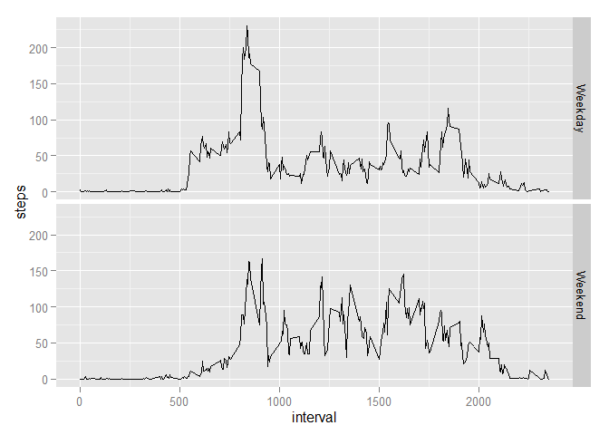

# Reproducible Research: Peer Assessment 1
Randy Sherwood  

This code will analyze step data. Start by importing the data:


```r
data <- read.table(unz("C:/Users/Randy/Dropbox/Coursera/5 Reproducible Research/Assignment 1/RepData_PeerAssessment1/activity.zip",
                       "activity.csv"), sep=",", header=TRUE)
```

The date field imported as a factor, so we must re-format it to be a date:


```r
data$date <- as.Date(as.character(data$date), "%Y-%m-%d")
```

For part 1, we need daily totals of steps, so the data must be aggregated to a daily level:


```r
options(warn=-1)

library(sqldf)
```

```
## Loading required package: gsubfn
## Loading required package: proto
## Loading required package: RSQLite
## Loading required package: DBI
```

```r
DailySteps <- sqldf('select
                    date
                    ,sum(steps) as steps
               from
                    data
               group by
                    date
               order by
                    date')
```

```
## Loading required package: tcltk
```

```r
library(ggplot2)

qplot(steps, data=DailySteps)
```

```
## stat_bin: binwidth defaulted to range/30. Use 'binwidth = x' to adjust this.
```

 

```r
mean.daily.steps <- format(mean(DailySteps$steps, na.rm=TRUE))

median.daily.steps <- format(median(DailySteps$steps, na.rm=TRUE))
```

The mean daily steps is **10766.19**, and the median is **10765**.  

Next, we need averages for every five-minute interval to analyze behavior over the span of a day:


```r
#calculate means
intervals <- as.data.frame(tapply(data$steps, data$interval, mean, na.rm=TRUE))
#create column for intervals
intervals$interval <- as.numeric(rownames(intervals))
#name columns
colnames(intervals) <- c("steps","interval")

qplot(interval, steps, data=intervals, geom="line", xlab="Interval", ylab="Average Steps")
```

 

```r
#find period with maximum average steps
max <- intervals[intervals$steps==max(intervals$steps),2]
```

The interval with the most steps, on average, is **835**.  

As the data contain many missing values, let's try estimating the actuals:


```r
#count missings
nmiss <- nrow(data[is.na(data$steps),])

#merge interval means to original data
cleaned <- merge(data, intervals, by.x="interval", by.y="interval", all.x=TRUE)
#re-order data
cleaned <- cleaned[order(cleaned$date, cleaned$interval),]
#replace nulls with interval means
cleaned$steps <- ifelse(is.na(cleaned$steps.x), cleaned$steps.y, cleaned$steps.x)
#subset, keeping needed columns
cleaned <- cleaned[,colnames(cleaned) %in% c("date","interval","steps")]

#create daily totals
CleanedDailySteps <- sqldf('select
                                date
                                ,sum(steps) as steps
                            from
                                cleaned
                            group by
                                date
                            order by
                                date')


qplot(steps, data=CleanedDailySteps)
```

```
## stat_bin: binwidth defaulted to range/30. Use 'binwidth = x' to adjust this.
```

 

```r
#calculate new mean
cleaned.mean <- format(mean(CleanedDailySteps$steps))

#calculate new median
cleaned.median <- format(median(CleanedDailySteps$steps))
```

There are a total of **2304** observations with missing step data.  

Using the five-minute-interval averages to fill in missings, the mean remains unchanged, at **10766.19**.  
However, the median gets pulled up to **10766.19**, which is the same as the mean.  
In general, this is the impact of imputation using a mean--it reduces variance within the dataset and leaves the mean unchanged.  

Next, let's investigate differences between weekdays and weekends:


```r
#create new factor variable with weekday/weekend
cleaned$day_type <- as.factor(ifelse(weekdays(cleaned$date) %in% c("Saturday", "Sunday"), "Weekend", "Weekday"))

library(plyr)

#roll up data to weekday/weekend + interval level
final <- ddply(cleaned, c("day_type","interval"), summarise, steps = mean(steps))

qplot(interval, steps, geom="line", data=final, facets = day_type~.)
```

 

It appears that, on weekdays, there are short periods of more steps, but there is a lower baseline, as compared to weekends which seem to have activity spread out throughout the day.  The data for weekends also suggests that the person is active later in the day, compared to weekdays.  This suggests that perhaps the person this data tracks takes a walk in the morning, but works a fairly inactive job, and tends to move around more on weekends.
